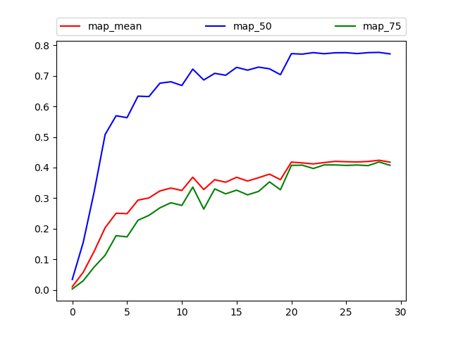

## Retinanet in Pytorch

pytorch version: 1.0.1


#### 1. VOC test

First, configure *train.json* file, add your root. 

```json
{
    "root_train": "/home1/xyt/dataset/VOC0712_trainval/JPEGImages",
    "root_eval": "/home1/xyt/dataset/VOCdevkit/VOC2007/JPEGImages",
    "list_train": "data/voc_trainval.txt",
    "list_eval": "data/voc_test.txt",
    "name_file": "data/voc_name.txt",

    "load": false,
    "save": true,
    "pretrain": true,
    "freeze_bn": true,
    "epoch_num": [20,10],

    "nbatch_train": 40,
    "nbatch_eval": 40,
    "device": [5,6,7,8,9],

    "lr": 0.01,
    "lr_decay": 0.1,
    "momentum": 0.9,
    "weight_decay": 0.0001,

    "boxarea_th": 25,
    "img_scale_min": 0.4,
    "crop_scale_min": 0.2,
    "aspect_ratio": [0.750, 1.333],
    "remain_min": 0.8,

    "grad_clip": 5
}
```

Then, configure some parameters in *detector.py* file.

```python
# TODO: choose backbone
from backbone import resnet50 as backbone
# TODO: configure Detector
self.a_hw = [
    [32.00, 32.00],
    [35.92, 35.92],
    [40.32, 40.32],
    [22.63, 45.25],
    [25.40, 50.80],
    [28.51, 57.01],
    [45.25, 22.63],
    [50.80, 25.40],
    [57.01, 28.51],
]
self.scales = 5
self.first_stride = 8
self.train_size = 641
self.eval_size = 641
self.iou_th = (0.3, 0.5)
self.classes = 20   # TODO: total 20 classes exclude background
self.nms = True
self.nms_th = 0.05
self.nms_iou = 0.5
self.max_detections = 1000
```

In my experiment, only 30 epochs were performed. Better results can be achieved if it takes longer.
run train to get results. It takes about 12 hours with 5x Titan-Xp. 
run analyze and got mAP@.5: **77.6%**




#### 2. COCO test

First, configure train.json file, add your root. 

```json
{
    "root_train": "/home1/xyt/dataset/coco17/images",
    "root_eval": "/home1/xyt/dataset/coco17/images",
    "list_train": "data/coco_train2017.txt",
    "list_eval": "data/coco_val2017.txt",
    "name_file": "data/coco_name.txt",

    "load": false,
    "save": true,
    "pretrain": true,
    "freeze_bn": true,
    "epoch_num": [10,3,2],

    "nbatch_train": 16,
    "nbatch_eval": 16,
    "device": [1,2,3,5,6,7,8,9],

    "lr": 0.01,
    "lr_decay": 0.1,
    "momentum": 0.9,
    "weight_decay": 0.0001,

    "boxarea_th": 25,
    "img_scale_min": 0.4,
    "crop_scale_min": 0.2,
    "aspect_ratio": [0.750, 1.333],
    "remain_min": 0.8,

    "grad_clip": 5
}
```

Then, configure some parameters in *detector.py* file.

```python
self.classes = 80   # TODO: total 80 classes exclude background
self.iou_th = (0.4, 0.5)
self.train_size = 1025
self.eval_size = 1025
```

run train to get results. It takes about _ hours with _x Titan-Xp. 
run analyze and got mAP: _%


