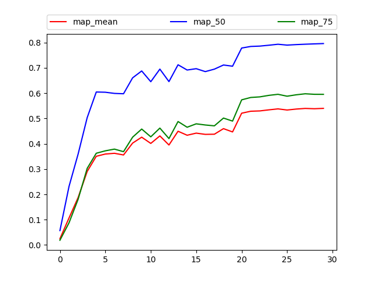
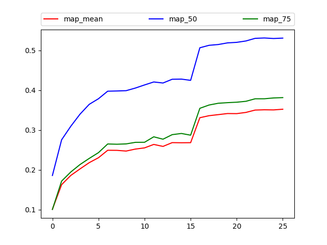

# RetinaNet in Pytorch

An unofficial implementation of RetinaNet in pytorch. 
Focal Loss for Dense Object Detection.

https://arxiv.org/abs/1708.02002

This repo achieves **35.5%** mAP at nearly 600px resolution with a Resnet-50 backbone. 


## 1. VOC test

First, configure *train.json* file, add your root. 

```json
{
    "root_train": "/home1/xyt/dataset/VOC0712_trainval/JPEGImages",
    "root_eval": "/home1/xyt/dataset/VOCdevkit/VOC2007/JPEGImages",
    "list_train": "data/voc_trainval.txt",
    "list_eval": "data/voc_test.txt",
    "name_file": "data/voc_name.txt",

    "load": false,
    "save": true,
    "pretrain": true,
    "freeze_bn": true,
    "epoch_num": [20,10],

    "nbatch_train": 21,
    "nbatch_eval": 21,
    "device": [1,2,3],
    "num_workers": 7,

    "lr": 0.01,
    "lr_decay": 0.1,
    "momentum": 0.9,
    "weight_decay": 0.0001,

    "boxarea_th": 16,
    "img_scale_min": 0.6,
    "crop_scale_min": 0.4,
    "aspect_ratio": [0.750, 1.333],
    "remain_min": 0.8,

    "grad_clip": 5
}
```

Then, configure some parameters in *detector.py* file.

```python
# TODO: choose backbone
from backbone import resnet50 as backbone
# TODO: configure Detector
self.train_size = 641
self.eval_size = 641
self.classes = 20   # TODO: total 20 classes exclude background
```

In my experiment, only 30 epochs were performed. Better results can be achieved if it takes longer.
run train to get results. It takes about 5 hours with 3x Titan-Xp. 
run analyze and got mAP@.5: **79.5%**




## 2. COCO test (data augmentation, longer time)

First, configure train.json file, add your root. 

```json
{
    "root_train": "/home1/xyt/dataset/coco17/images",
    "root_eval": "/home1/xyt/dataset/coco17/images",
    "list_train": "data/coco_train2017.txt",
    "list_eval": "data/coco_val2017.txt",
    "name_file": "data/coco_name.txt",

    "load": false,
    "save": true,
    "pretrain": true,
    "freeze_bn": true,
    "epoch_num": [16,6,4],

    "nbatch_train": 16,
    "nbatch_eval": 16,
    "device": [1,2,3,5,6,7,8,9],
    "num_workers": 16,
    
    "lr": 0.01,
    "lr_decay": 0.1,
    "momentum": 0.9,
    "weight_decay": 0.0001,

    "boxarea_th": 16,
    "img_scale_min": 0.6,
    "crop_scale_min": 0.4,
    "aspect_ratio": [0.750, 1.333],
    "remain_min": 0.8,

    "grad_clip": 5
}
```

Then, configure some parameters in *detector.py* file.

```python
self.classes = 80   # TODO: total 80 classes exclude background
self.train_size = 1025
self.eval_size = 1025
```

Run train to get results. It takes about 40 hours with 8x Titan-Xp. Run analyze to get mAP curves.



Run cocoeval and got mAP: **35.5%**

```python
 Average Precision  (AP) @[ IoU=0.50:0.95 | area=   all | maxDets=100 ] = 0.355
 Average Precision  (AP) @[ IoU=0.50      | area=   all | maxDets=100 ] = 0.536
 Average Precision  (AP) @[ IoU=0.75      | area=   all | maxDets=100 ] = 0.382
 Average Precision  (AP) @[ IoU=0.50:0.95 | area= small | maxDets=100 ] = 0.194
 Average Precision  (AP) @[ IoU=0.50:0.95 | area=medium | maxDets=100 ] = 0.391
 Average Precision  (AP) @[ IoU=0.50:0.95 | area= large | maxDets=100 ] = 0.472
 Average Recall     (AR) @[ IoU=0.50:0.95 | area=   all | maxDets=  1 ] = 0.294
 Average Recall     (AR) @[ IoU=0.50:0.95 | area=   all | maxDets= 10 ] = 0.454
 Average Recall     (AR) @[ IoU=0.50:0.95 | area=   all | maxDets=100 ] = 0.483
 Average Recall     (AR) @[ IoU=0.50:0.95 | area= small | maxDets=100 ] = 0.291
 Average Recall     (AR) @[ IoU=0.50:0.95 | area=medium | maxDets=100 ] = 0.529
 Average Recall     (AR) @[ IoU=0.50:0.95 | area= large | maxDets=100 ] = 0.612
```


## 3. COCO test (standard)

Like 2 in rain.json, modify key "epoch_num".

```json
"epoch_num": [9,3,2],
```

Modify line-95 of *utils_box/dataset.py* as follows.

```python
if self.train:
    img, boxes = random_flip(img, boxes)
    # if random.random() < 0.5:
    #     img, boxes = random_rotation(img, boxes)
    # img, boxes, scale = random_resize_fix(img, boxes, size,
    #     self.img_scale_min, self.crop_scale_min, self.aspect_ratio, self.remain_min)
    # if random.random() < 0.5:
    #     img = transforms.ColorJitter(brightness=0.1, contrast=0.1, saturation=0.1, hue=0.1)(img)
    img, boxes, scale = corner_fix(img, boxes, size)   
```

It takes about 21 hours with 8x Titan-Xp.  Run analyze to get mAP curves.

