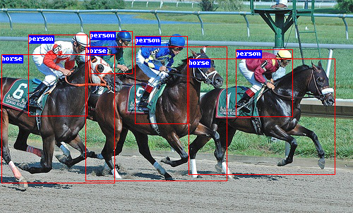

# RetinaNet in Pytorch

An unofficial implementation of RetinaNet in pytorch. 
Focal Loss for Dense Object Detection.

https://arxiv.org/abs/1708.02002

This repo achieves **35.5%** mAP at nearly 700px resolution with a Resnet-50 backbone. 




## 1. VOC

First, configure *train.json* file, add your root. 

```json
{
    "root_train": "/home/xyt/dataset/VOC0712_trainval/JPEGImages",
    "root_eval": "/home/xyt/dataset/VOCdevkit/VOC2007/JPEGImages",
    "list_train": "data/voc_trainval.txt",
    "list_eval": "data/voc_test.txt",
    "name_file": "data/voc_name.txt",

    "load": false,
    "save": true,
    "pretrain": true,
    "freeze_bn": true,
    "freeze_stages": true,
    "epoches": 30,

    "nbatch_train": 28,
    "nbatch_eval": 28,
    "device": [0,1,2,3],
    "num_workers": 14,

    "lr_base": 0.01,
    "lr_gamma": 0.1,
    "lr_schedule": [16000, 22000],
    "momentum": 0.9,
    "weight_decay": 0.0001,

    "boxarea_th": 32,
    "grad_clip": 3,

    "img_scale_min": 0.6,
    "augmentation": false
}
```

Then, configure some parameters in *detector.py* file.

```python
# TODO: choose backbone
from backbone import resnet50 as backbone
# TODO: configure Detector
self.view_size = 641
self.classes = 20   # TODO: total 20 classes exclude background
```

In my experiment, only 30 epochs were performed. Better results can be achieved if it takes longer.
run train to get results. It takes about 5 hours with 4x Titan-Xp. 
run analyze and got mAP@.5: **79.1%**

```python
map_mean
[0.0372 0.1881 0.312  0.3404 0.3744 0.3819 0.3969 0.4198 0.4351 0.452
 0.4424 0.4602 0.4708 0.4692 0.4735 0.4725 0.4683 0.4809 0.4755 0.4909
 0.5218 0.5249 0.525  0.5219 0.5261 0.5251 0.524  0.5249 0.5247 0.5258]
map_50
[0.0861 0.3869 0.5774 0.6091 0.6529 0.6574 0.6697 0.6924 0.7126 0.7339
 0.7158 0.7387 0.7425 0.7427 0.7431 0.7493 0.7435 0.7473 0.7394 0.7567
 0.7884 0.7925 0.7889 0.7878 0.792  0.792  0.7868 0.7899 0.7905 0.7909]
map_75
[0.026  0.1617 0.2952 0.3366 0.3847 0.393  0.4169 0.4451 0.4621 0.4809
 0.47   0.4879 0.5032 0.5026 0.5053 0.5108 0.502  0.5129 0.5166 0.5329
 0.5632 0.5661 0.5642 0.5654 0.5667 0.5661 0.5654 0.565  0.5654 0.5656]
```


## 2. COCO (1x)

First, configure train.json file, add your root. 

```json
{
    "root_train": "/home1/xyt/dataset/coco17/images",
    "root_eval": "/home1/xyt/dataset/coco17/images",
    "list_train": "data/coco_train2017.txt",
    "list_eval": "data/coco_val2017.txt",
    "name_file": "data/coco_name.txt",

    "load": false,
    "save": true,
    "pretrain": true,
    "freeze_bn": true,
    "freeze_stages": true,
    "epoches": 12,

    "nbatch_train": 16,
    "nbatch_eval": 16,
    "device": [1,2,3,5,6,7,8,9],
    "num_workers": 16,

    "lr_base": 0.01,
    "lr_gamma": 0.1,
    "lr_schedule": [60000, 80000],
    "momentum": 0.9,
    "weight_decay": 0.0001,

    "boxarea_th": 32,
    "grad_clip": 3,

    "img_scale_min": 0.8,
    "augmentation": false
}
```

Then, configure some parameters in *detector.py* file.

```python
self.view_size = 1025
self.classes = 80   # TODO: total 80 classes exclude background
```

It takes about 21 hours with 8x Titan-Xp.  Run analyze to get mAP curves.

```python
map_mean
[0.1401 0.2009 0.2189 0.2455 0.2534 0.2556 0.2672 0.2726 0.3224 0.3291
 0.3329 0.3343]
map_50
[0.2548 0.3444 0.3679 0.4026 0.4157 0.4158 0.4316 0.4363 0.5043 0.5142
 0.5174 0.5193]
map_75
[0.1392 0.2068 0.2273 0.257  0.2668 0.2696 0.2831 0.2906 0.3442 0.3549
 0.3576 0.3588]
```

Run cocoeval and got mAP: **33.7%**

```python
 Average Precision  (AP) @[ IoU=0.50:0.95 | area=   all | maxDets=100 ] = 0.337
 Average Precision  (AP) @[ IoU=0.50      | area=   all | maxDets=100 ] = 0.524
 Average Precision  (AP) @[ IoU=0.75      | area=   all | maxDets=100 ] = 0.361
 Average Precision  (AP) @[ IoU=0.50:0.95 | area= small | maxDets=100 ] = 0.178
 Average Precision  (AP) @[ IoU=0.50:0.95 | area=medium | maxDets=100 ] = 0.370
 Average Precision  (AP) @[ IoU=0.50:0.95 | area= large | maxDets=100 ] = 0.445
 Average Recall     (AR) @[ IoU=0.50:0.95 | area=   all | maxDets=  1 ] = 0.277
 Average Recall     (AR) @[ IoU=0.50:0.95 | area=   all | maxDets= 10 ] = 0.432
 Average Recall     (AR) @[ IoU=0.50:0.95 | area=   all | maxDets=100 ] = 0.462
 Average Recall     (AR) @[ IoU=0.50:0.95 | area= small | maxDets=100 ] = 0.275
 Average Recall     (AR) @[ IoU=0.50:0.95 | area=medium | maxDets=100 ] = 0.501
 Average Recall     (AR) @[ IoU=0.50:0.95 | area= large | maxDets=100 ] = 0.583
```


## 3. COCO (2x)

Like 2 in *train.json* modify key

```json
"epoches": 24,
"lr_schedule": [120000, 160000],
```

Run train to get results. It takes about 40 hours with 8x Titan-Xp. Run analyze to get mAP curves.

```python
map_mean
[0.1006 0.1625 0.1857 0.2021 0.2178 0.2302 0.2489 0.2487 0.2469 0.2519
 0.2549 0.2636 0.2586 0.2681 0.2678 0.268  0.3308 0.3358 0.3385 0.3412
 0.341  0.344  0.35   0.3507 0.3504 0.3521]
map_50
[0.1855 0.2752 0.3094 0.3398 0.3644 0.3784 0.3974 0.3979 0.3987 0.4052
 0.4131 0.4206 0.418  0.4274 0.4278 0.4246 0.5065 0.5127 0.5147 0.5188
 0.5202 0.5236 0.5302 0.5311 0.5298 0.5308]
map_75
[0.1001 0.1715 0.1944 0.2131 0.2285 0.243  0.2647 0.2641 0.2649 0.2688
 0.269  0.2828 0.2767 0.2882 0.2911 0.2868 0.3544 0.3626 0.3671 0.3686
 0.3697 0.372  0.3783 0.3783 0.3804 0.3813]
```

Run cocoeval and got mAP: **35.5%**

```python
 Average Precision  (AP) @[ IoU=0.50:0.95 | area=   all | maxDets=100 ] = 0.355
 Average Precision  (AP) @[ IoU=0.50      | area=   all | maxDets=100 ] = 0.536
 Average Precision  (AP) @[ IoU=0.75      | area=   all | maxDets=100 ] = 0.382
 Average Precision  (AP) @[ IoU=0.50:0.95 | area= small | maxDets=100 ] = 0.194
 Average Precision  (AP) @[ IoU=0.50:0.95 | area=medium | maxDets=100 ] = 0.391
 Average Precision  (AP) @[ IoU=0.50:0.95 | area= large | maxDets=100 ] = 0.472
 Average Recall     (AR) @[ IoU=0.50:0.95 | area=   all | maxDets=  1 ] = 0.294
 Average Recall     (AR) @[ IoU=0.50:0.95 | area=   all | maxDets= 10 ] = 0.454
 Average Recall     (AR) @[ IoU=0.50:0.95 | area=   all | maxDets=100 ] = 0.483
 Average Recall     (AR) @[ IoU=0.50:0.95 | area= small | maxDets=100 ] = 0.291
 Average Recall     (AR) @[ IoU=0.50:0.95 | area=medium | maxDets=100 ] = 0.529
 Average Recall     (AR) @[ IoU=0.50:0.95 | area= large | maxDets=100 ] = 0.612
```


